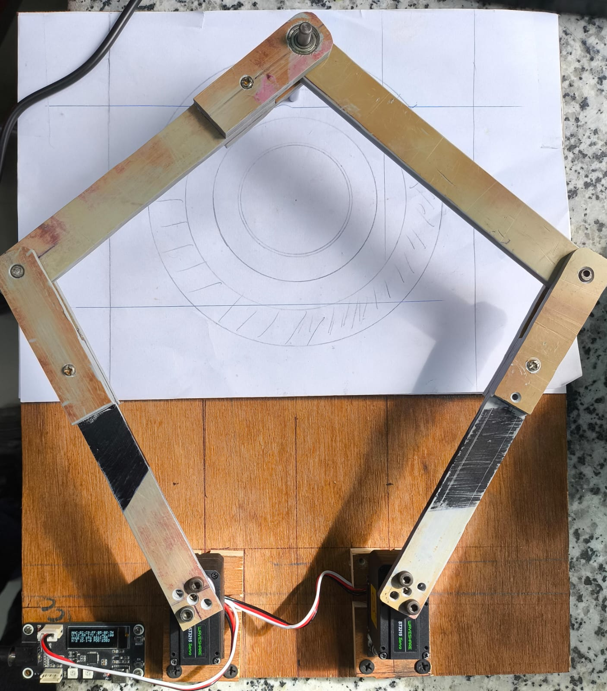

# Pantographic Haptic Feedback Device using Waveshare ST3215 servos

### Description:

TThe following repository was used as a base for the implementation : https://github.com/waveshare/Servo-Driver-with-ESP32 

## WiFi Access Point Definition Instructions

Add a header file named `secrets.h` in the ServoDriver subfolder and include the following lines in it:

```cpp
const char* STA_SSID = "your ssid";
const char* STA_PWD  = "your wifi password";
```
The board will connect the above wifi credentials with the ip address 192.168.1.100
p.s. please verify the lines 426 - 428 of CONNECT.h to make sure the wifi router uses the same ip ranges and gateway IP.
update these values in case needed

### Updates with respect to cloned repo

 1) switch to st as default servo
 2) switch from access point mode to external wifi connection
 3) added the possibility to change the locking torque of the servo with /setTorque rest api endpoint / modify SMS_STS.h and .cpp files
 4) Add logic in CONNECT.h to implement pantographic haptic device using two ST3215(HS also tested) 
 5) Replace Old Webpage with new one which allows user to verify the end effector position.

### Adding SCServo library 
 Please add the SCServo folder to the following path 
 ```
 Documents\Arduino\libraries
```

### Pictures of the haptic device


